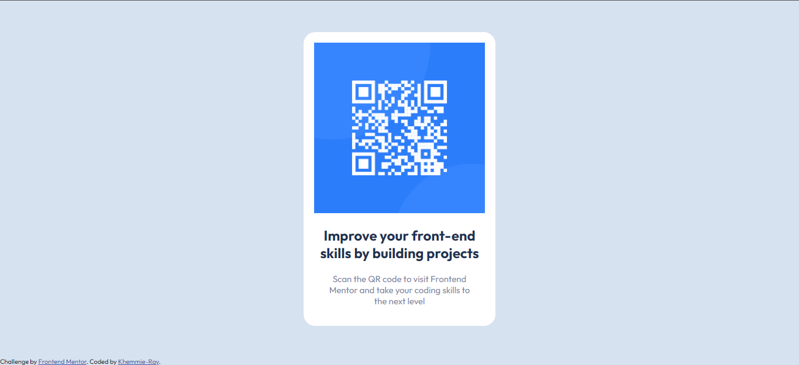

# Frontend Mentor - QR code component solution

This is a solution to the [QR code component challenge on Frontend Mentor](https://www.frontendmentor.io/challenges/qr-code-component-iux_sIO_H). Frontend Mentor challenges help you improve your coding skills by building realistic projects. 

## Table of contents

- [Overview](#overview)
  - [Screenshot](#screenshot)
  - [Links](#links)
- [My process](#my-process)
  - [Built with](#built-with)
  - [Continued development](#continued-development)
  - [Useful resources](#useful-resources)
- [Author](#author)

## Overview
This is my own attempt at solving the QR code component challenge on Frontend Mentor. Frontend Mentor challenges help you improve your coding skills by building realistic projects. 

### Screenshot

### Links

- Solution URL: [Add solution URL here](https://github.com/Khemmie-Ray/QR-code-component.git)
- Live Site URL: [Add live site URL here](https://khemmie-ray.github.io/QR-code-component/)

## My process

### Built with

The use of Visual Studio Code

- HTML5
- CSS flexbox

### Continued development

I will continue to focus on understanding and learning more about a responsive and accessible design because the mobile view specification was a bit challenging for me.

### Useful resources

- https://www.w3schools.com/
-https://scrimba.com/

## Author

- Frontend Mentor - [@Khemmie-Ray](https://www.frontendmentor.io/profile/Khemmie-Ray)
